# 🏦 Meridian Bank: AI-Powered DevSecOps Banking Platform

An enterprise-grade, containerized financial core engine built on **Spring Boot 3** and **Java 21**, featuring contextual AI-driven customer intelligence. Secured via an automated **9-Gate DevSecOps Pipeline** using keyless OpenID Connect (OIDC) authentication and AWS managed infrastructure.

---

## 🛠️ Architecture & Technology Stack

The platform separates execution concerns into distinct network segments within AWS, leveraging managed identity, secrets rotation, and dedicated AI endpoints.

```mermaid
graph TD
    subgraph "Public Internet"
        GH[GitHub Actions CI/CD]
        User[User Web Browser]
    end

    subgraph "AWS Private Cloud (VPC)"
        subgraph "Application Cluster"
            AppEC2[Application Host (Ubuntu/Docker)]
            DB[(MySQL 8.0 Secure Engine)]
        end

        subgraph "Cognitive AI Cluster"
            Ollama[Ollama EC2 - TinyLlama Host]
        end

        subgraph "Identity & Configuration"
            Secrets[AWS Secrets Manager]
            OIDC[AWS IAM OIDC Identity Provider]
        end

        subgraph "Registry"
            ECR[Private ECR Repository]
        end
    end

    GH -->|1. Authenticate via OIDC| OIDC
    GH -->|2. Build & Push Image| ECR
    GH -->|3. Orchestrate Deployment| AppEC2
    GH -->|4. Trigger DAST Scan| AppEC2
    
    User -->|Access HTTPS:8080| AppEC2
    AppEC2 -->|JDBC Credentials| DB
    AppEC2 -->|REST Endpoint| Ollama
    AppEC2 -->|Pull Runtime Secrets| Secrets
    AppEC2 -->|Deploy Container| ECR
```

### Technical Blueprint
*   **Backend Framework**: Java 21, Spring Boot 3.4.13, Spring Security, Hibernate JPA
*   **Core Database**: MySQL 8.0 Database
*   **AI Service**: Ollama Engine (running `tinyllama` locally)
*   **Cloud Infrastructure**: Amazon EC2, Elastic Container Registry (ECR), VPC, Systems Manager
*   **DevOps Tooling**: Docker, Docker Compose, GitHub Actions, AWS CLI, jq, curl

---

## 🛡️ DevSecOps Security Guardrails

Our continuous integration and deployment workflow enforces **9 sequential security gates** before shipping to staging or production.

| Gate | Stage | Technology | Focus |
| :---: | :--- | :--- | :--- |
| **1** | Secret Scanning | **Gitleaks** | Prevents commits containing credentials/API keys |
| **2** | Code Quality & Lint | **Checkstyle** | Enforces Java Google-Style coding standards |
| **3** | SAST Scan | **Semgrep** | Checks source code against OWASP Top 10 vulnerabilities |
| **4** | SCA Scan | **OWASP Dependency Check** | Audits third-party libraries for known CVEs |
| **5** | Compilation & Build | **Maven Wrapper** | Compiles project files and executes unit tests |
| **6** | Container Auditing | **Trivy** | Scans container base image layers for OS vulnerabilities |
| **7** | Artifact Delivery | **Amazon ECR** | Delivers scanned and approved images to ECR registry |
| **8** | Automation Deploy | **Docker Compose** | Pulls from ECR and securely starts the updated stack |
| **9** | DAST Scan | **OWASP ZAP** | Launches active security attacks on live app endpoints |

---

## 🚀 Setup & Execution Guide

### Phase 1: Establish AWS Infrastructure

#### 1. Container Registry (ECR)
Create a private ECR repository called `devsecops-bankapp` to store build images.

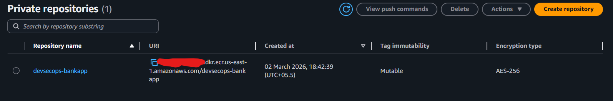

#### 2. Host Instance (Application Server)
Launch an Ubuntu 22.04 EC2 instance. In the `User Data` script, initialize the base docker dependencies:

```bash
#!/bin/bash
sudo apt update 
sudo apt install -y docker.io docker-compose-v2 jq
sudo usermod -aG docker ubuntu
sudo newgrp docker
sudo snap install aws-cli --classic
```

*   **Security Groups**: Permit incoming traffic on Port `22` (SSH management) and Port `8080` (App server port).
*   **IAM Instance Profile**: Assign a role to the EC2 instance with the following AWS managed policies:
    *   `AmazonEC2ContainerRegistryPowerUser`
    *   `AWSSecretsManagerClientReadOnlyAccess`

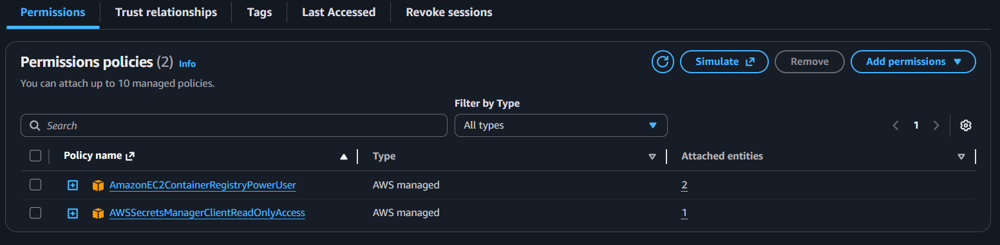
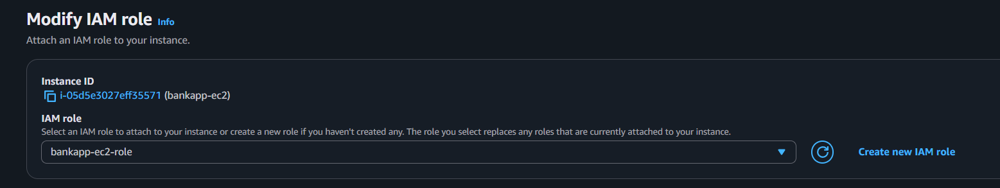

#### 3. AI Service Host (Ollama Instance)
Create a standalone EC2 host for running the AI services. 
*   **Networking**: Open Port `11434` for traffic originating from the Application Server security group.
*   **Initialization**: Run the automated script [scripts/ollama-setup.sh](scripts/ollama-setup.sh) via EC2 User Data to configure the server environment.

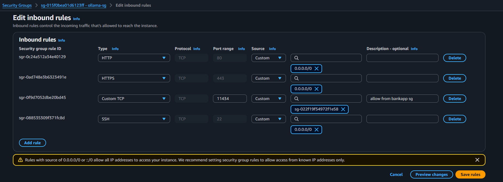
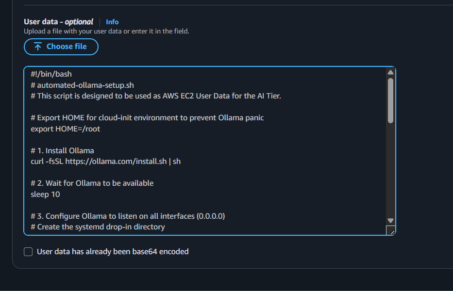

Ensure the models are pulled and ready by running `ollama list` on the AI instance:

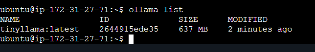

---

### Phase 2: Keyless OIDC Identity Provider

GitHub Actions connects to your AWS account without hardcoded keys using OpenID Connect (OIDC).

1.  **Identity Provider Registry**:
    *   **Provider URL**: `https://token.actions.githubusercontent.com`
    *   **Audience**: `sts.amazonaws.com`

    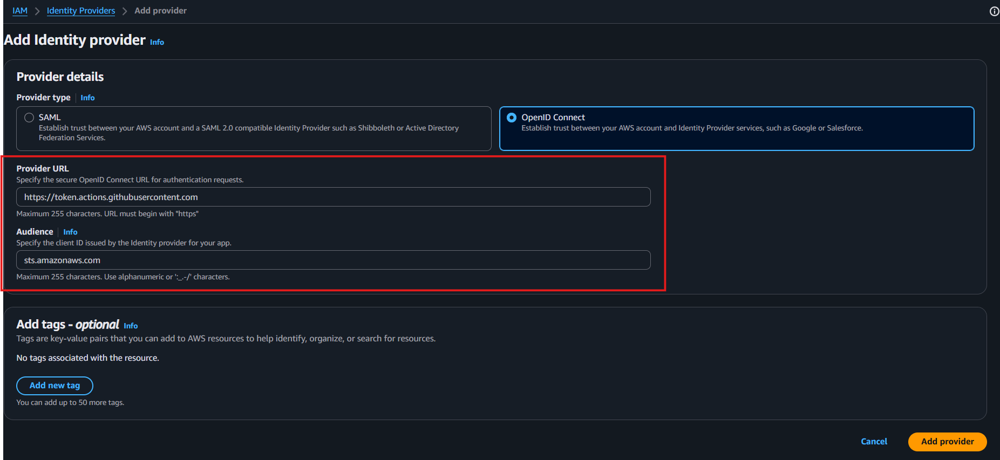

2.  **Deployment Role Creation**:
    *   Create a role named `GitHubActionsRole` linked to the OIDC provider.
    *   Specify your GitHub username/organization, repository name, and the main branch.
    *   Attach the `AmazonEC2ContainerRegistryPowerUser` policy.

    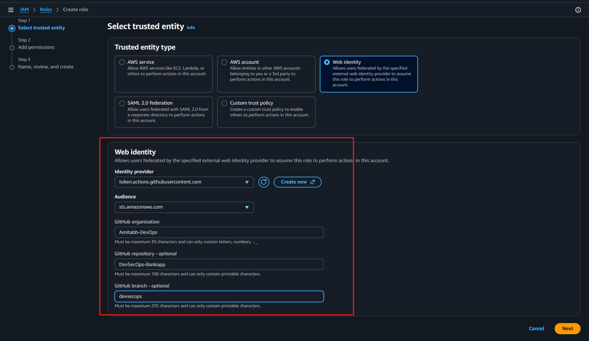
    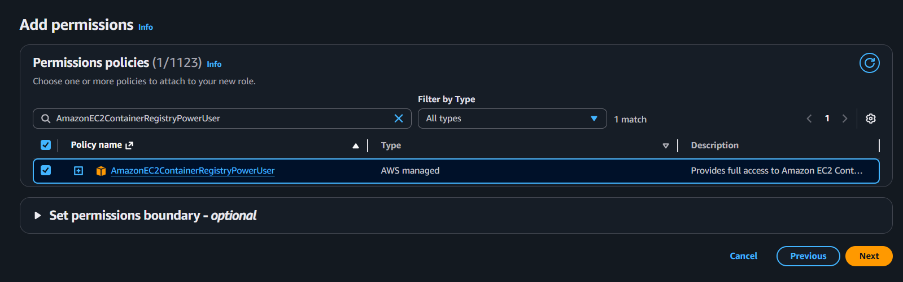
    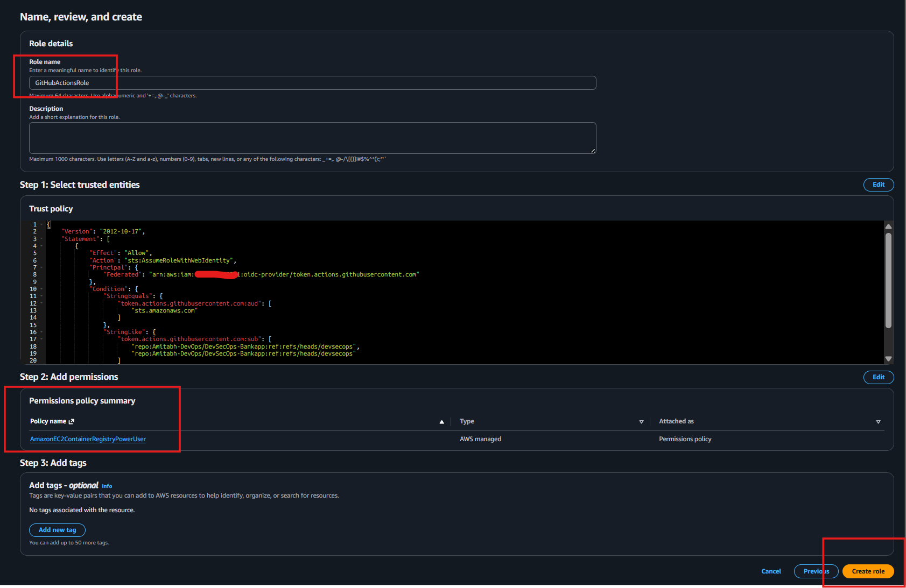

---

### Phase 3: Secret Store & Action Variables

#### 1. AWS Secrets Manager
Store runtime values in a secret named `bankapp/prod-secrets`:

| Secret Key | Description | Default / Example Value |
| :--- | :--- | :--- |
| `DB_HOST` | Database host name / container service name | `db` |
| `DB_PORT` | MySQL connection port | `3306` |
| `DB_NAME` | Schema name | `bankappdb` |
| `DB_USER` | Connection username | `bankuser` |
| `DB_PASSWORD` | Secure password | `Test@123` |
| `OLLAMA_URL` | Endpoint of the Ollama host | `http://<OLLAMA-PRIVATE-IP>:11434` |

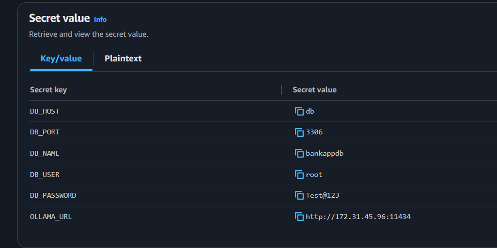

#### 2. GitHub Repository Configuration
Under Repository **Settings** → **Secrets and variables** → **Actions**, add the following:

| Secret Name | Description / Target Value |
| :--- | :--- |
| `AWS_ROLE_ARN` | The ARN of the `GitHubActionsRole` role |
| `AWS_REGION` | Target AWS region (e.g. `us-east-1`) |
| `AWS_ACCOUNT_ID` | Your 12-digit AWS Account ID |
| `ECR_REPOSITORY` | ECR repository name (`devsecops-bankapp`) |
| `EC2_HOST` | Public IP address of the Application Server |
| `EC2_USER` | SSH access user (default: `ubuntu`) |
| `EC2_SSH_KEY` | Private SSH key (PEM file content) |
| `NVD_API_KEY` | [Request here](https://nvd.nist.gov/developers/request-an-api-key) to accelerate SCA scanning |

> [!TIP]
> Using an `NVD_API_KEY` raises NVD API rate limits, reducing the SCA scanning phase time from 30+ minutes down to 8 minutes.

#### How to Activate the NVD API Key:
1.  **Request**: Visit [nvd.nist.gov](https://nvd.nist.gov/developers/request-an-api-key), enter your details, and submit the request.
    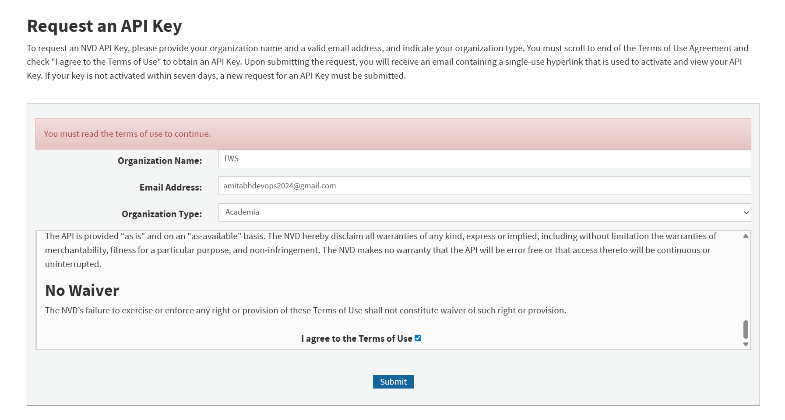
2.  **Activation**: Check email for confirmation and follow the activation link.
    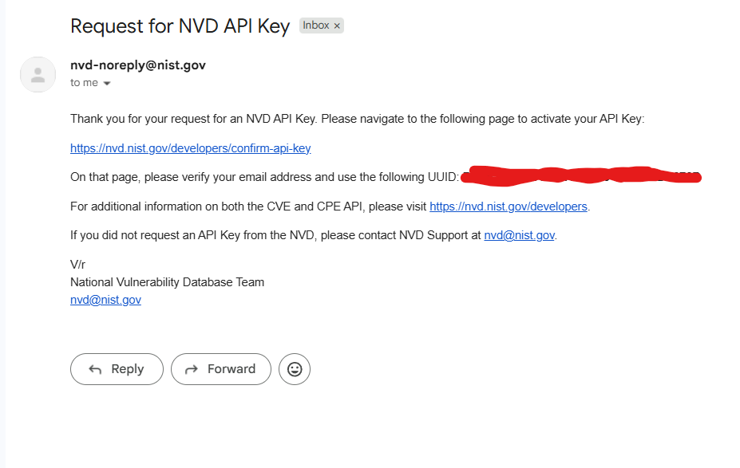
    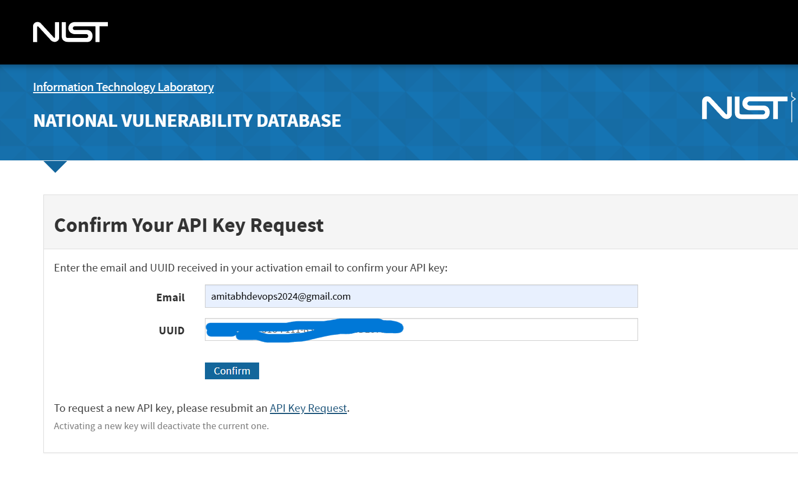
3.  **Deploy**: Copy the generated API key, then add it as a new secret `NVD_API_KEY` in GitHub.
    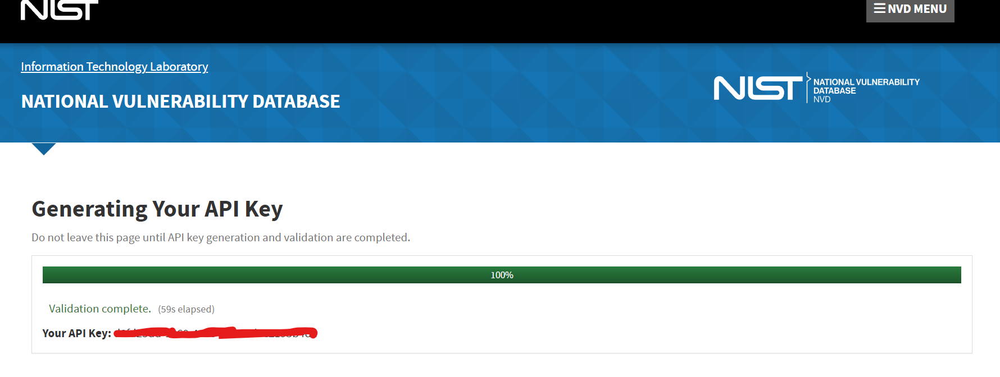
    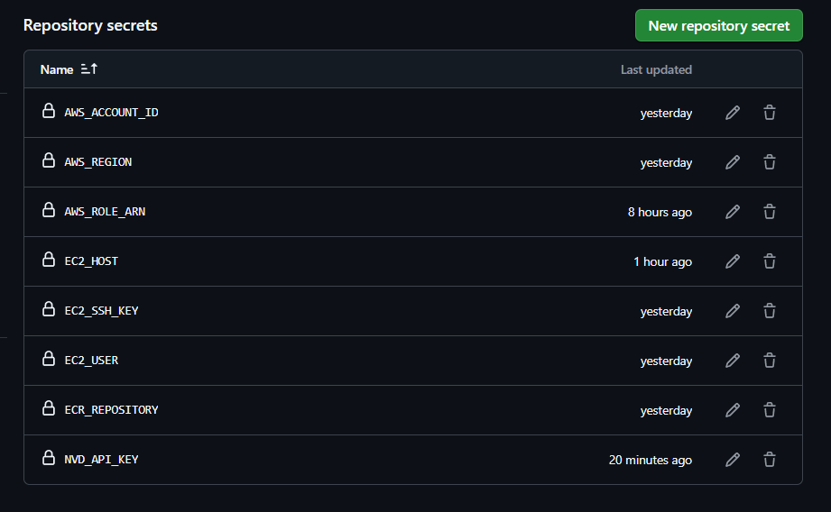

---

## 🔄 CI/CD Pipeline Summary

Our build is orchestrated using [devsecops-main.yml](.github/workflows/devsecops-main.yml), triggering modular checks across three stages: [ci.yml](.github/workflows/ci.yml), [build.yml](.github/workflows/build.yml), and [cd.yml](.github/workflows/cd.yml).

*   **Secret Check & SAST**: Strict failure if vulnerabilities or secrets are detected in the repository history.
*   **SCA & Image Scan**: Strict failure on dependencies containing CVSS > 7.0 or Critical/High docker vulnerabilities.
*   **DAST (ZAP)**: Conducted in audit mode. Reports are outputted as downloadable artifacts for review.

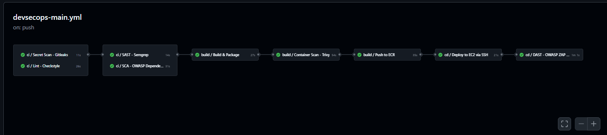
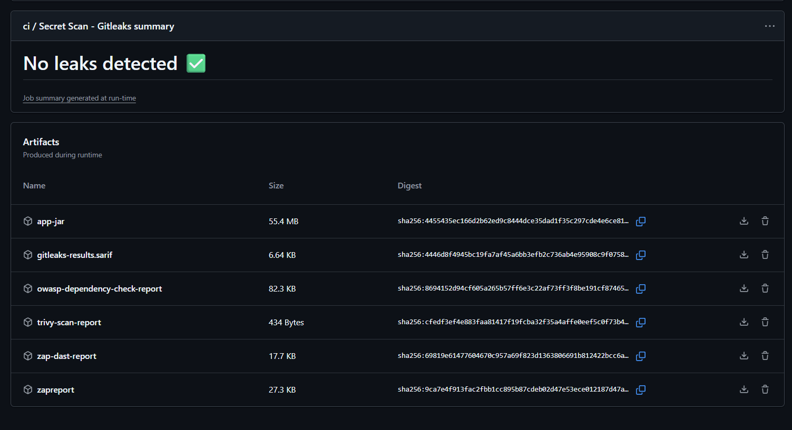

---

## 🔎 Verification & Diagnostics

To check the runtime health of application processes on the server:

*   **Runtime Status**: `docker ps`
    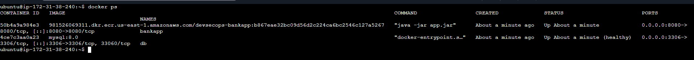

*   **Verify Live Page**:
    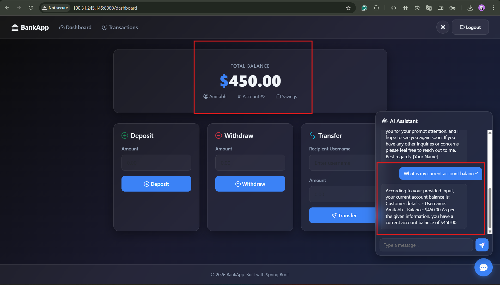

*   **Database Connectivity Check**:
    ```bash
    docker exec -it db mysql -u <USER> -p bankappdb -e "SELECT * FROM accounts;"
    ```
    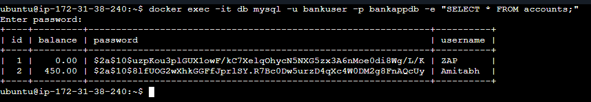

*   **Network Diagnostics to AI Instance**:
    ```bash
    nc -zv <OLLAMA-PRIVATE-IP> 11434
    ```
    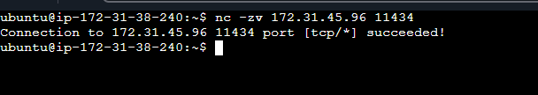